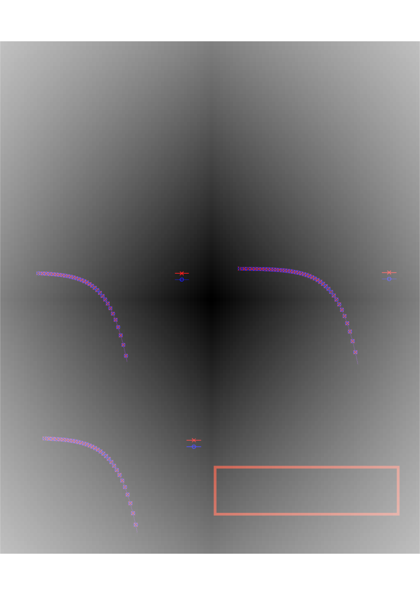

<!--タイトルの位置,headerを固定化。 タイトルはpositionを左から25px,上から20pxの場所に固定化する-->
<!--全体に影響-->

<!--このスライドのみ以下を適用-->
<!--
_class: lead
_paginate: false
_header:   ""
_footer: セミナー@産総研　Date: 2021.12.24
-->

<!--このスライドだけタイトル以外の文字を中央揃えにする。-->

<!-- 以下よりスライドの始まり-->
## **Hybrid quantum-classical algorithm for computing imaginary-time correlation functions**
  Rihito Sakurai
  (Ph.D. student of the Graduate School of Science & Engineering, Saitama University)

---

<!--このスライドだけタイトル以外の文字を中央揃えにする。-->

New preprint
===========

  <!---->
  <!---->
  
  **Today's talk is based on**
  > ## **Hybrid quantum-classical algorithm for computing imaginary-time correlation functions**
  > <https://arxiv.org/abs/2112.02764>

  **collaborator**
   Wataru Mizukami (QIQB, Oska Univ.),
   Hiroshi Shinaoka (Saitama Univ.)

---

# Computational materials science

Density functional theory (DFT)
- Approximates the electronic quantum state with a single slater determinant.
- Success：Many semiconductors and metals
- Strong：Low computational cost ~$O(N^3$) (N: #of orbitals).
- Weakness : strongly correlated electron systems 
(e.g. cuprate high-temperature superconductivity) 

---
# Quantum embedding theory  (Dynamical mean-field theory)

- Focus on one part of the whole system
- effective bath parameters are determined from the self-consistent condition:
- Physical quantities described by response functions are important.
(single-particle excitation spectral functions or lattice spin susceptibility) 
- In the field of quantum chemistry, density matrix embedding theory (DMET) are used. 
 
- Why are multi-orbital and multi-atomic important?
-->quantitative description of unconventional superconductivity
<!--エネルギー方向にもバスがある。依存した-->

---
# Dynamical mean-field theory (DMFT)
- The biggest bottle neck: **quantum impurity problem (Computing Green's function)**

- Single impurity with few orbitals are the limit by classical methods: Quantum Monte Carlo , MPS/Tensor network 

- Solving impurity models wit multi-orbital and multi impurity sites is a challenging task.

|    |  $G(t)/G(\omega)$ (Real) | $G(\tau)/G(i\omega)$ (Imaginary)   |
| ---- | ---- | ---- |
|  Pros  |  Accurate description of spectral functions  |  Fewer bath sites    |
|  Cons  |   Many bath sites             |  Inaccurate description of spectral functions   at high frequencies  |

<!-- -->

---
# Solving impurity problems with Quantum computer

<!--このスライドのみ以下を適用-->
<!--
_class: lead
_paginate: false
_header:   ""
_footer:   ""
-->

#### Foult-tolerant quantum computer

- Algorithm based on Quantum phase estimation algorithm (~2015)
- Too much hardware resources

#### Quantum devices with limited hardware resources 
- e.g.) Noisy Intermediate Scale Devices (NISQ) 
noisy quantum devices with ~100 qubits, about 100 depth (# of time steps)
- Need to calculate expectation value of the square of the Hamiltonian 
(H. Chen et _al_., arXiv :2105.01703v2) 
- Efficient methods for computing imaginary-time Green's functions need to be explored
- Our work: new algorithm to compute the imaginary-time Green's function

---
# Imaginary-time Green's function 

<!---->

##### Hamiltonian

$$
{H} = \sum_{ij}^N t_{ij} \hat c^\dagger_i \hat c_j + \frac{1}{4} \sum_{ijkl} U_{ikjl}\hat c_i^\dagger \hat c_j^\dagger \hat c_l \hat c_k - \mu \sum_i \hat c^\dagger_i \hat c_i,$$

$c_i/c^\dagger_i$ : the creation and annihilation operators for the spin orbital $i$

##### Imaginary-time Green's function (GF)

$$G_{a b}(\tau)=-\theta(\tau)\left\langle\hat{c}_{a}(\tau) \hat{c}_{b}^{\dagger}(0)\right\rangle + \theta(\tau) \left\langle\hat{c}_{b}^{\dagger}(0) \hat{c}_{a}(\tau)\right\rangle, \tau = it, \hbar=k_{\mathrm{B}}=1,$$

- At sufficiently low temperature $T$
$$G_{a b}(\tau) \underset{T \rightarrow 0}{=} \mp\left\langle\Psi_{\mathrm{G}}\left|\hat{A}_{\pm} e^{\mp\left(\mathcal{H}-E_{\mathrm{G}}\right) \tau} \hat{B}_{\pm}\right| \Psi_{\mathrm{G}}\right\rangle,  |\Psi_{\mathrm{G}}\rangle:\text{ground state}$$

$
A_{+}=\hat{c}_{a} \text { and } B_{+}=\hat{c}_{b}^{\dagger} \text { for } 0 < \tau <\frac{\beta}{2}, 
$

$
A_{-}=\hat{c}_{b}^{\dagger} \text { and } B_{+}=\hat{c}_{a} \text { for } -\frac{\beta}{2}<\tau<0
$
$(\beta=1/T)$

---

# Outline of our algorithm 

<!--
_class: lead
_paginate: false
_header:   ""
_footer: セミナー@産総研　Date: 2021.12.24
-->

<!--文字を上から書くようにする。デフォルトだと中央から書き始める。-->

-  Introduce a fine mesh of $\tau$ in [-$\beta$ / 2, $\beta$ / 2]  
-  Then, compute $G_{ij}(\tau)$ 

For $\tau$>0, 
$
\begin{aligned}
\\ G_{i j}(\tau) 
 &=-\operatorname{Tr}\left[e^{-\beta \hat{H}} c_{i}(\tau) c_{j}^{\dagger}(0)\right] / \operatorname{Tr}\left(e^{-\beta \mathcal{H}}\right) \\
&\simeq-\underbrace{\left\langle\Phi_{G}(0)\right| e^{-(\beta-\tau) \hat{H}}}_{\left\langle\Phi_{C}^{\prime}\right|}  c_{i}(0)\underbrace{e^{-\tau \hat{H}} c_{j}^{\dagger}(0)\left|\Phi_{G}(0)\right\rangle}_{\left|\Phi_{C}\right\rangle}/\left(e^{-\beta E_{G}}\right)
\end{aligned}
$

---
# STAGE1: Ground-state calculation 

<!--ここはより簡潔なVQEの図に置き換える。例えば、Quantum easy taskとclassical-->

### Preparation
- The hamiltonian need to be transformed to the qubit representation 
  e.g.) Jordan-Wigner transformation
$$
\begin{aligned}
H & \rightarrow \sum_{p}^{} h_{p} S_{p},  S_{p}\in\{X, Y, Z, I\}^{\otimes m}
\end{aligned}
$$

### Variational Quantum Eigensolver (VQE) ------>
:small_blue_diamond:**Optimization**: parameter-shift rule
 <https://arxiv.org/pdf/1803.00745.pdf>
 

$\left.\frac{\partial\langle H(\theta)\rangle}{\partial \theta_{i}}=\frac{1}{2}\left( H\left(\theta+\frac{\pi}{2} e_{i}\right)\right)-\left\langle H\left(\theta-\frac{\pi}{2} e_{i}\right)\right\rangle\right)$
$(U(\boldsymbol{\theta})=\prod_{k} e^{-i \theta_{k} P_{k} / 2})$

---
# STAGE2: Single-particle excitation

<!---->

<!--
 $\hat{c}_{a}^{\dagger}\left|\Psi_{\mathrm{GS}}\right\rangle \simeq c_{1}\left|\phi_{\mathrm{EX}}\left(\vec{\theta}_{\mathrm{EX}}\right)\right\rangle$ for $\tau>0$
 we compute the coefficient $c_1$ and $\vec{\theta}_{\mathrm{EX}}^{*}$ according to following steps.
 -->

#####
For $\tau>0$, 
$\hat{c}_{a}^{\dagger}\left|\Psi_{\mathrm{GS}}\right\rangle \simeq c_{1}\left|\phi_{\mathrm{EX}}\left(\vec{\theta}_{\mathrm{EX}}\right)\right\rangle$ 

1. single-particel excited state
$c_{a}^{\dagger}\left|\Psi_{G}\right\rangle=\frac{X_{a}-i Y_{a}}{2} Z_{a-1} \ldots Z_{1}\left|\Psi_{G}\right\rangle$

2. Prepare $\left|\phi_{\mathrm{EX}}\left(\vec{\theta}_{\mathrm{EX}}\right)\right\rangle$ and measure $\left\langle\phi_{\mathrm{EX}}\left(\vec{\theta}_{\mathrm{EX}}\right)\left|\hat{c}_{a}^{\dagger}\right| \Psi_{\mathrm{G}}\right\rangle$

3. Minimize cost function: 
$|1-\langle\Psi_{EX}(\vec{\theta})| c_{a}^{\dagger}\left|\Psi_{G}\right\rangle|^2$

4. Measure 
$c_{1}=\left\langle\phi_{\mathrm{EX}}\left(\vec{\theta}_{\mathrm{EX}}^{*}\right)\left|c_{a}^{\dagger}\right| \Psi_{\mathrm{G}}\right\rangle$

---
# STAGE3: Imaginary-time evolution

- The time-dependent Schrödinger equation

$\frac{\mathrm{d}}{\mathrm{d} \tau}|\tilde{\Psi}(\tau)\rangle=-\left({H}-E_{\tau}\right)|\tilde{\Psi}(\tau)\rangle$

$|\tilde{\Psi}(\tau)\rangle \equiv|\Psi(\tau)\rangle / \sqrt{\langle\Psi(\tau) \mid \Psi(\tau)\rangle}, E_{\tau}\equiv\langle\tilde{\Psi}(\tau)|{H}| \tilde{\Psi}(\tau)\rangle$

- Prepare the following state on a quantum computer
$|\tilde{\Psi}(\tau)\rangle=|\phi(\vec{\theta}(\tau))\rangle$
$|\Psi(\tau)\rangle=e^{\eta(\tau)}|\phi(\vec{\theta}(\tau))\rangle -(1)$

- Introduce Norm $e^{\eta(\tau)}$ : 
$\frac{\mathrm{d}}{\mathrm{d} \tau}|\Psi(\tau)\rangle=-{H}|\Psi(\tau)\rangle -(2)$ 
- From (1) and (2), 
$\frac{d\eta(\tau)}{d\tau}=-E_{\tau} , (\eta \in \mathbb{R}  \text{ and} \frac{\mathrm{d}\langle\Psi \mid \Psi\rangle}{\mathrm{d} \tau}=0)$

Question: How do we determine $\vec{\theta}(\tau)$ on a discrete mesh of $\tau$ ?
**McLachlan’s variational principal**  (A. McLachlan, Mol. Phys 8, 39-44 (1996)) $\min \delta\left\|\left(\frac{\mathrm{d}}{\mathrm{d} \tau}+{H}-E_{\tau}\right) \mid \phi(\vec{\theta}(\tau))\rangle\right\|$

---
# STAGE3: Imaginary-time evolution

#### Varuational Quantum Simulation (VQS)
$\min \delta\left\|\left(\frac{\mathrm{d}}{\mathrm{d} \tau}+{H}-E_{\tau}\right) \mid \phi(\vec{\theta}(\tau))\rangle\right\|$

$\sum_{j} A_{i j} \dot{\theta}_{j}= C_{i}$

$\begin{aligned} A_{i j} & \equiv \mathcal{R} \frac{\partial\langle\phi(\vec{\theta})|}{\partial \theta_{i}} \frac{\partial|\phi(\vec{\theta})\rangle}{\partial \theta_{j}},  C_{i} & \equiv-\mathcal{R}\langle\phi(\tau)| \mathcal{H} \frac{\partial|\phi(\vec{\theta})\rangle}{\partial \theta_{i}} \end{aligned}$

$\vec{\theta}(\tau+\Delta \tau) \simeq \vec{\theta}(\tau)+A^{-1} \vec{C} \Delta \tau$

#### Direct VQS
$
\begin{aligned}
&\theta(\tau+\Delta \tau) \\
&\simeq \underset{\vec{\theta}}{\operatorname{argmin}} \||\phi(\vec{\theta})\rangle-|\Psi(\tau)\rangle+\Delta \tau\left(\mathcal{H}-E_{\tau}\right)|\Psi(\tau)\rangle \|
\end{aligned}
$
$=\underset{\vec{\theta}}{\operatorname{argmin}} \operatorname{Re} \mid \Delta \tau\langle\phi(\vec{\theta})|H| \Psi(\tau)\rangle-\left(\Delta \tau E_{\tau}+1\right)\langle\phi(\vec{\theta}) \mid \Psi(\tau)\rangle$

---
# STAGE4: Transition amplitude 

transition amplitude
$\left\langle\Psi_{\mathrm{G}}\left|A_{\pm}\right| \Psi_{\mathrm{IM}}\right\rangle$

-->$G(\tau)
=-c_{1} e^{\eta(\tau)} e^{\tau E_{\mathrm{G}}}\left\langle\Psi_{\mathrm{G}}\left|A_{\pm}\right| \Psi_{\mathrm{IM}}\right\rangle$

---
# Numerical Details

#### Ansatz
- Unitary coupled cluster with generalized singles and doubles (UCCGSD)
(M. Nooijen, Phys. Rev. Lett. **84**, 2108 (2000), 
J. Lee, _et al_., Journal  of  chemical  theory and computation **15**, 311 (2019))
- $U(\boldsymbol{\theta})=
 \prod_{i, j, a, b=1}^{n}\left\{e^{\theta_{i j}^{a b} a_{a}^{\dagger} a_{b}^{\dagger} a_{j} a_{i}- \theta_{i j}^{a b}a_{i}^{\dagger} a_{j}^{\dagger} a_{b} a_{a}}\right\} \prod_{a, i=1}^{n}\left\{e^{\theta_{i}^{a} a_{a}^{\dagger} a_{i}-\theta_{i}^{a } a_{i}^{\dagger} a_{a}}\right\}$

- $N_p:$ # of the parameters ~ $O\left(n_{}^{4}\right)$

#### Optimization
- A quasi-Newton method (BFGS method)

#### Non-uniform mesh of $\tau$ in $[-\beta / 2, \beta / 2]$ ($\beta=1000$)
- A sparse mesh generated according to the intermediate-representation (IR) basis. 
(J. Li _et al_.,  PRB **101**, 035144 (2020))

---
# Results: Dimer model

<!---->
 
$
\begin{aligned}
\mathcal{H} &=U \hat{n}_{1 \dagger} \hat{n}_{1 \downarrow}-\mu \sum_{\sigma=\uparrow, \downarrow} \hat{n}_{1 \sigma} -V \sum_{\sigma=\uparrow, \downarrow}\left(\hat{c}_{1 \sigma}^{\dagger} \hat{c}_{2 \sigma}+\hat{c}_{2 \sigma}^{\dagger} \hat{c}_{1 \sigma}\right)+\epsilon_{b} \sum_{\sigma=\uparrow, \downarrow} \hat{n}_{2 \sigma}
\end{aligned}
$

- $U$=1,$\mu$=1/2, $V$=1, $\epsilon_{b}$=1
- At half-filling
- #of parameters: 104
- 79 sparse sampling points 
- Non-diagonal componet also can be computed

---

# Results : Four-site model 

$
\begin{aligned}
H &=U \hat{n}_{0 \uparrow} \hat{n}_{0 \downarrow}-\mu \sum_{\sigma=\uparrow, \downarrow} \hat{n}_{0 \sigma} -\sum_{k=1}^{3} \sum_{\sigma=\uparrow, \downarrow} V_{k}\left(\hat{c}_{0 \sigma}^{\dagger} \hat{c}_{k \sigma}+\hat{c}_{k \sigma}^{\dagger} \hat{c}_{0 \sigma}\right)+\epsilon_{k} \sum_{k=1}^{3} \sum_{\sigma=\uparrow, \downarrow} \hat{n}_{k \sigma}
\end{aligned}
$

- value of parametes is obtained by DMFT calculation
- At half-filling
- #of parameters: 1568 
- 70 sparse sampling points + adaptive construction of the mesh

---

# Results : Fourier-transformed Green's function

- We use a library called「irbasis」 (N. Chikano _et al_., Comput. Phys. Commun. **240**, 181 (2019))
- Fourier-transformed Green's function (Matsubara Green's function) $G_{a b}(\mathrm{i} \nu)=\int_{0}^{\beta} \mathrm{d} \tau e^{\mathrm{i} \nu \tau} G_{a b}(\tau)$

<!--ここにコメントアウトした文字が反映される！-->
<!--$\tau$-->

---
## Conclution
- New hybrid quantum classical algorithm for computing imaginary-time Green's functions by applying the VQS
- Out algorithms efficiently computes GF using non-uniform mesh based on IRbasis 
- No need to calculate expectation value of the square of the Hamiltonian 
(H. Chen et _al_., arXiv :2105.01703v2)
- The hardware cost for transition amplitude may be high for NISQ devices :disappointed_relieved:

##  future plan
:one:**Simulation under realistic noise model**: 2 qubit error
:two:**Ansatz for impurity models**: tensor decomposition, topology of impurity models

---
 以下、聴講者からのコメントと質問をまとめたスライド。

---
# 柿澤コメント
- VQEの図はより簡潔な図に置き換える
- グリーン関数の引数に-はいらない（修正する）
- 論文も直す必要性あり。
- もう少し練習が必要

---
# 品岡コメント1
- 論理を先に話すより結論を先に話す。
- スライドの話の間の繋ぎを滑らかにする。要素感の接続。関連性を明確にする。特にイントロから結果に入る前あたりまで。
- 
- 

---
# 品岡コメント2

- 実例として、ハバードアトムなどのグリーン関数の図を見せる(上のスライド）)
- 指数関数
- 数式との対応づける。
- N --> N+1 --> N
- 虚時間が
- Non-uniform なメッシュの図
- correction vectorの先行研究と何が非自明なのか。
- $\beta$: fictious temperature
- 応答関数で記述される物理量（スペクトル関数とか格子スピン感受率）が物性では重要。定量的な物性値が可能になる。
- なぜ多軌道重要か。
- DMFT  
- 複数不純物クラスターの低温での計算は困難。
- 将来的に、量子で
- 有限温度の
- 量子化学計算で使われるDMETとの違い。応答関数があるかないか。
- 特に物性では、応答関数は重要。
- 松原グリーン関数の定義と自己無撞着計算への必要性が抜けている気がします
- 

---
# 星野質問
- Q. DMFT自己無撞着計算はこのアルゴリズムを使って行っているのか？
- A. いいえ、行っていない。自己無撞着計算で得られたパラメータだけを使っている。VQEとVQSが正確ならば、このパラメータが得られる。
- 今後、ノイズや離散化誤差が自己無撞着計算にどのような影響を与えるのか、解析接続における誤差やノイズの影響を考慮していく。
- Q. ４サイト不純物モデルに縮退はあるのか？
- A. ない。ハーフフィリングから粒子がひとつ異なる粒子数を持つ部分空間をはる状態間で、固有エネルギーが非常に近い。
- Q. 不安定性の原因は何か？そこにグリーン関数の構造はあるのか？
- A. この図ではわからないが、構造（変化）は微妙に存在することは確認できた。
- Q. 不安定性の原因を調べるために、小さいサイズの系のモデルで、パラメータの数をヒルベルト空間の次元より小さくしたアンザッツで解いたのか？
- A. まだやっていない。
- 内容はわかっている感じはした

--- 
# 産総研発表までに行うタスク一覧
 **太字**は、優先度高め

- **松原グリーン関数の定義をどこかに書く。多分、最初か、最後の結果のスライドのどっちか。**
- **自己無撞着計算の必要性について述べる。** 最初に適当にパラメタを決める。そこから、ループをこれはバスに関するパラメータをアップデートする。不純物モデルと元々の格子系におけるグリーン関数が一致したら、計算を止める。
- 
- 最後のスライドに、不純物モデルに特化したアンザッツとして、工夫したアンザッツの足を制限した概念の図と、テンソル圧縮の先行文献みたいなものを載せる？
- 最後のスライドに、現状のハードウェアでは、VQEで多軌道、多クラスターの不純物モデルの問題を解くには難しい。他のアルゴリズムが必要か？モンテカルロ＋量子コンピュータ？
- **数値的不安定性の原因**については、今後行うことにかく？
- **不純物モデルの定義のスライドにハミルトニアンのパラメータとアンザッツにつかったパラメータの数についても書く。**
- VQEの図を簡略化する。あるいは今のスライドでもっと説明もちゃんとする。が、おそらく前者。？
- 実周波数グリーン関数と虚時間グリーン関数

---

# 産総研発表までに行うタスク一覧2
- DMFTを虚時間グリーン関数で行うメリット。バスの数が減らせる点。
- ただ、解析接続時に高周波数の領域のスペクトル関数が精度良く再現しづらい。
- 実時間・実周波数/虚時間・虚周波数
- 実時間形式は、バスの数が多く
- 擬似温度というものを導入します。これは温度の逆数です。
- どういう物質を定量的に計算したいのか？
|prso|cons|

- 自己無撞着計算の話
- バスの離散化(Dicsritization the freedom of the environment with bath sites)
- 実時間と許時間形式のメリット
- 通常,虚数波数を用いることが多い。
- 
